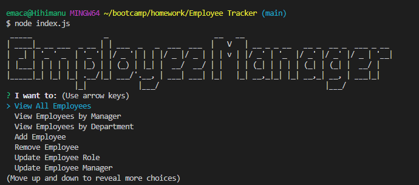

# Employee Manager

## Table of Contents

- [License](#license)
- [Links](#links)
- [User Story](#user-story)
- [Technology Used](#technology-used)
- [Installation](#installation)
- [Screenshots](#screenshots)
- [Questions](#questions)

## Description

This Employee Tracker is a homework project to create an interface that makes it easy for non-developers to view and interact with information stored in and employee database. The idea is to get more comfortable using SQL databases and have a working employee management system application.

## License

- 

## Links

- [Github Repository](https://github.com/emacartoon/Employee-Tracker)
- [Video Walkthrough](https://drive.google.com/file/d/1OE_ZolB_xcqFe8iKn8zEbuCQAQB0PsXJ/view)

## User Story

As a business owner I want to be able to view and manage the departments, roles, and employees in my company so that I can organize and plan my business.

## Technology Used

JavaScript
Node.js 
Inquirer
MySQL

## Installation

After cloning down the repository, you will want to open your terminal to run the program.

Then navigate the project directory, using the terminal you can run:

### `npm i`

to install all the Node modules. With your SQL server running, run db/schema.sql to create the proper database and tables. I have included a seeds.sql file to import some example data to manipulate for testing.

After that has completed, you may type:

#### `npm index.js`

to run the app in the terminal. Follow the prompts to add and manipulate your employee data.

## Screenshots

Screenshot

## Questions

If you have any questions about this project, or happen to use this project, please feel free to reach out to me:
 
Email: emacartoon@gmail.com
 
GitHub: [@EmaCartoon](https://github.com/EmaCartoon)

